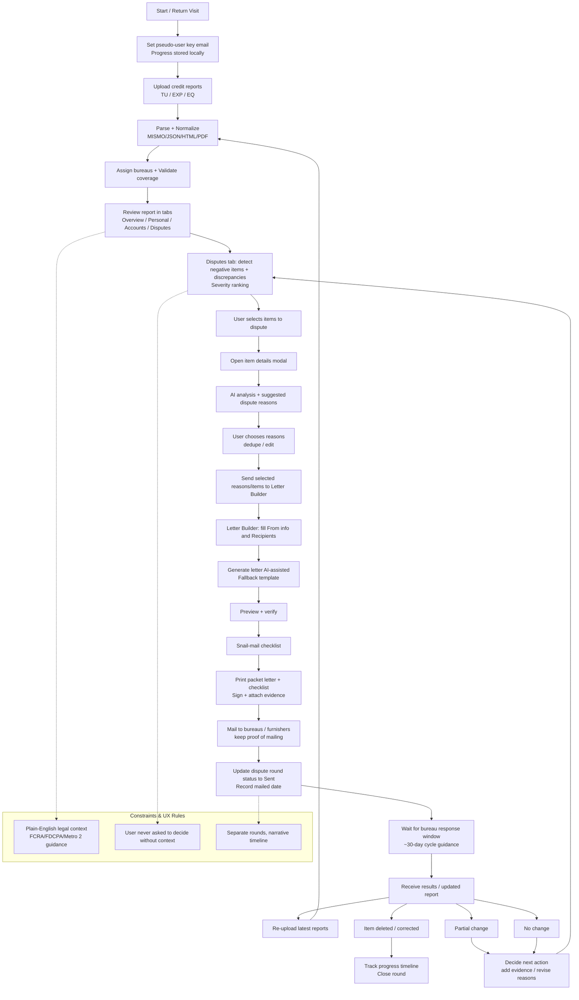

# Core Loop (App)

## Notes

- The system is designed around iterative **30-day dispute cycles**: upload → analyze → dispute → generate letter → mail → mark sent → wait → re-upload.
- The loop branches based on outcomes (deleted/corrected, partial, no change), then feeds back into refining disputes or starting the next round.
