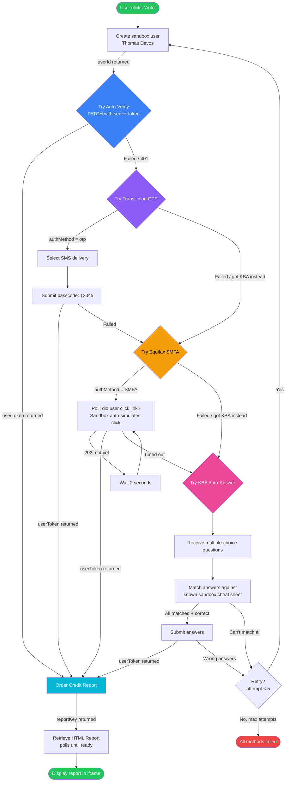
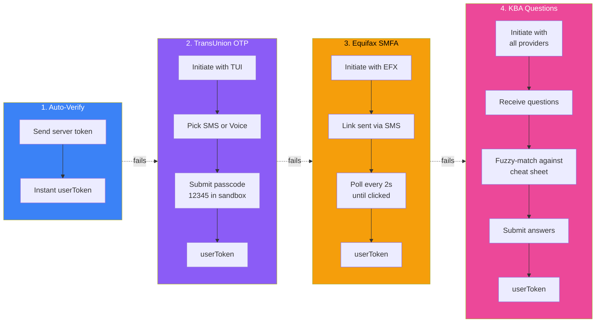
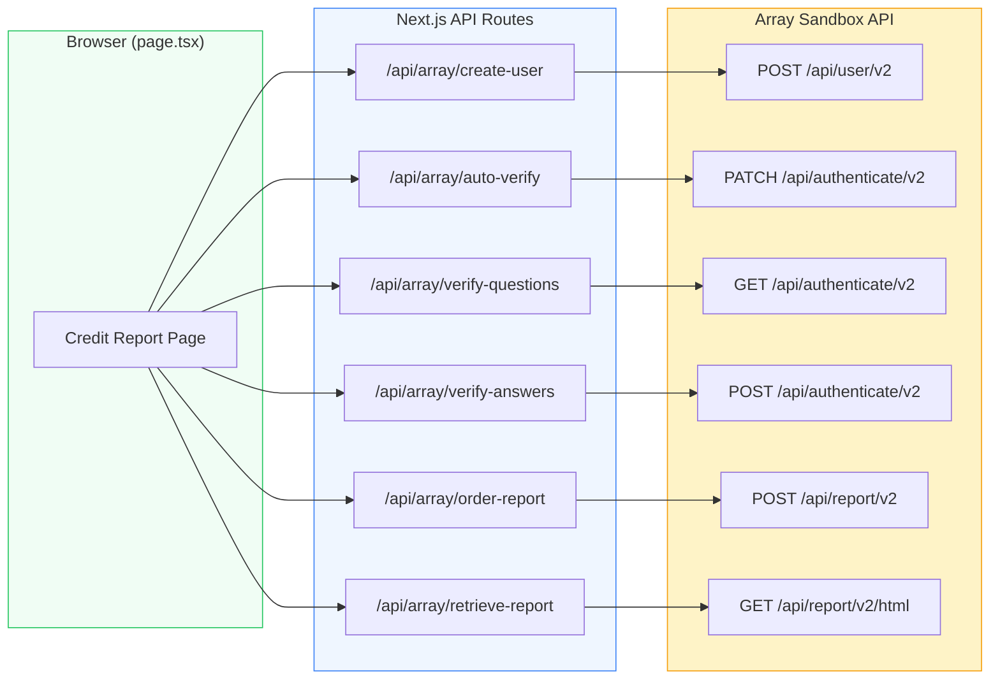
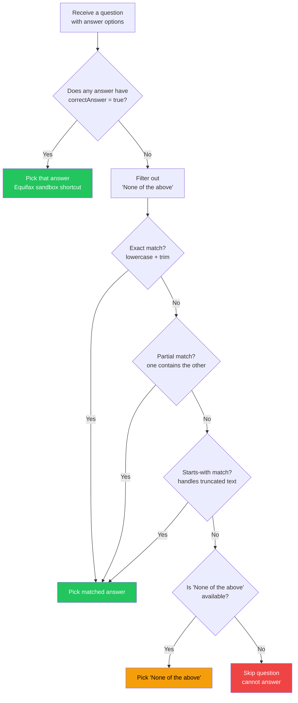

# Array Credit Report Flow

Visual walkthrough of how the `/credit-report` page pulls a sandbox credit report.

## Full Auto Flow (tries all methods)

## Verification Methods Compared

## API Route Map

## KBA Answer Matching Logic

