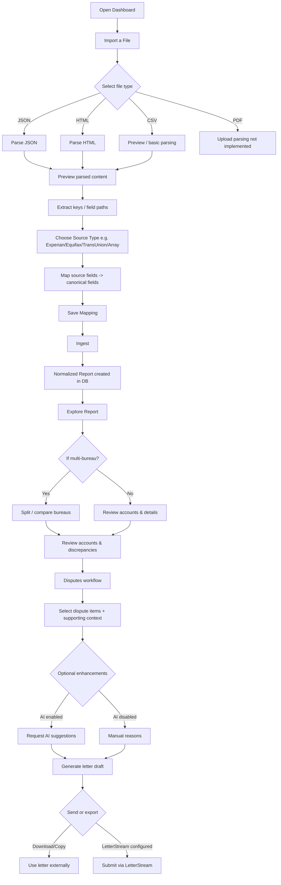

# End-User Flow (Credit Import Dashboard)

```mermaid
flowchart TD
  A[Open Dashboard] --> B[Import a File]

  B --> C{Select file type}
  C -->|JSON| D[Parse JSON]
  C -->|HTML| E[Parse HTML]
  C -->|CSV| F[Preview / basic parsing]
  C -->|PDF| G[Upload parsing not implemented]

  D --> H[Preview parsed content]
  E --> H
  F --> H

  H --> I[Extract keys / field paths]
  I --> J[Choose Source Type e.g. Experian/Equifax/TransUnion/Array]

  J --> K[Map source fields -> canonical fields]
  K --> L[Save Mapping]

  L --> M[Ingest]
  M --> N[Normalized Report created in DB]

  N --> O[Explore Report]
  O --> P{If multi-bureau?}
  P -->|Yes| Q[Split / compare bureaus]
  P -->|No| R[Review accounts & details]

  Q --> S[Review accounts & discrepancies]
  R --> S

  S --> T[Disputes workflow]
  T --> U[Select dispute items + supporting context]

  U --> V{Optional enhancements}
  V -->|AI enabled| W[Request AI suggestions]
  V -->|AI disabled| X[Manual reasons]

  W --> Y[Generate letter draft]
  X --> Y

  Y --> Z{Send or export}
  Z -->|Download/Copy| AA[Use letter externally]
  Z -->|LetterStream configured| AB[Submit via LetterStream]
```
