# Credit Report Dispute Workflow

## User Journey Overview

## Detailed Phase Breakdown

### Phase 1: Authentication (Future)

### Phase 2: Report Upload Flow

### Phase 3: Disputes Tab Workflow

### Phase 4: Dispute Round Lifecycle

## Severity-Based Dispute Priority

```mermaid
flowchart TD
    subgraph HIGH["🔴 HIGH PRIORITY - Address First"]
        H1[Collections]
        H2[Charge-offs]
        H3[90+ Days Late]
        H4[Public Records]
        H5[Bankruptcies]
    end

    subgraph MEDIUM["🟡 MEDIUM PRIORITY - Address Second"]
        M1[60 Days Late]
        M2[Derogatory Marks]
        M3[High Utilization Reports]
        M4[Account Status Errors]
    end

    subgraph LOW["🔵 LOW PRIORITY - Address Last"]
        L1[30 Days Late]
        L2[Hard Inquiries]
        L3[Minor Discrepancies]
        L4[Personal Info Errors]
    end

    HIGH --> MEDIUM
    MEDIUM --> LOW
```

## Letter Generation Flow

